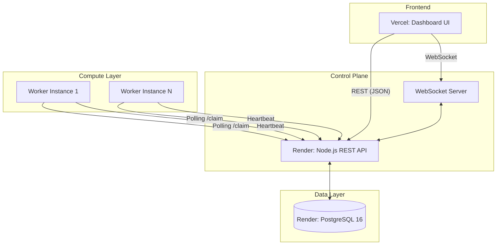

# System Architecture

## Architecture Diagram

## Flow Description
1. **Job Ingestion:** The user creates a job via the Dashboard UI (REST POST). The API writes the job to PostgreSQL with a `queued` status.
2. **Real-time Updates:** The API triggers a WebSocket broadcast. The Dashboard UI instantly updates the pending count.
3. **Atomic Claiming:** Workers continuously poll the `/claim` endpoint. The API executes a `SELECT ... FOR UPDATE SKIP LOCKED` query on PostgreSQL to lock a batch of jobs atomically, ensuring no duplicates.
4. **Execution & Retry:** The worker executes the job payload. On success, it calls `/complete`. On failure, it calls `/fail`. The API evaluates the retry policy, either pushing the `run_at` timestamp forward (exponential backoff) or moving it to the Dead Letter Queue.
