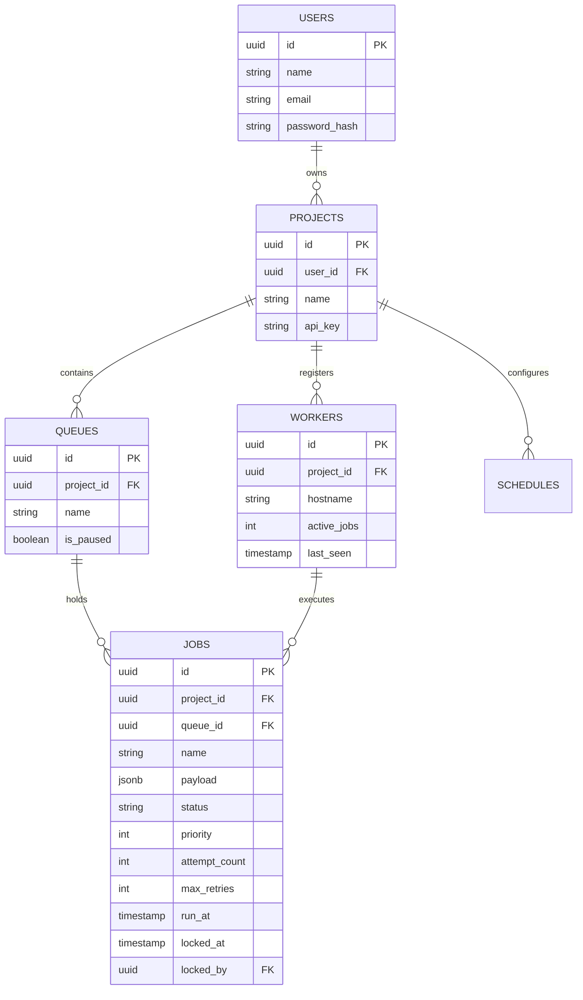

# Database Design & ER Diagram

## Entity-Relationship Diagram

## Performance & Normalization Considerations
- **Concurrency Control:** The `jobs` table uses `locked_at` and `locked_by` to track ownership. Using Postgres row-level locks prevents duplicate processing.
- **Indexes:** B-Tree indexes are heavily utilized on `(project_id, queue_id, status, run_at)` to optimize the `FOR UPDATE SKIP LOCKED` query, ensuring rapid job fetching even with millions of rows.
- **Cascading Behavior:** Foreign keys from `jobs` to `projects` are set up with `ON DELETE CASCADE` to ensure data integrity when tenants are removed.
