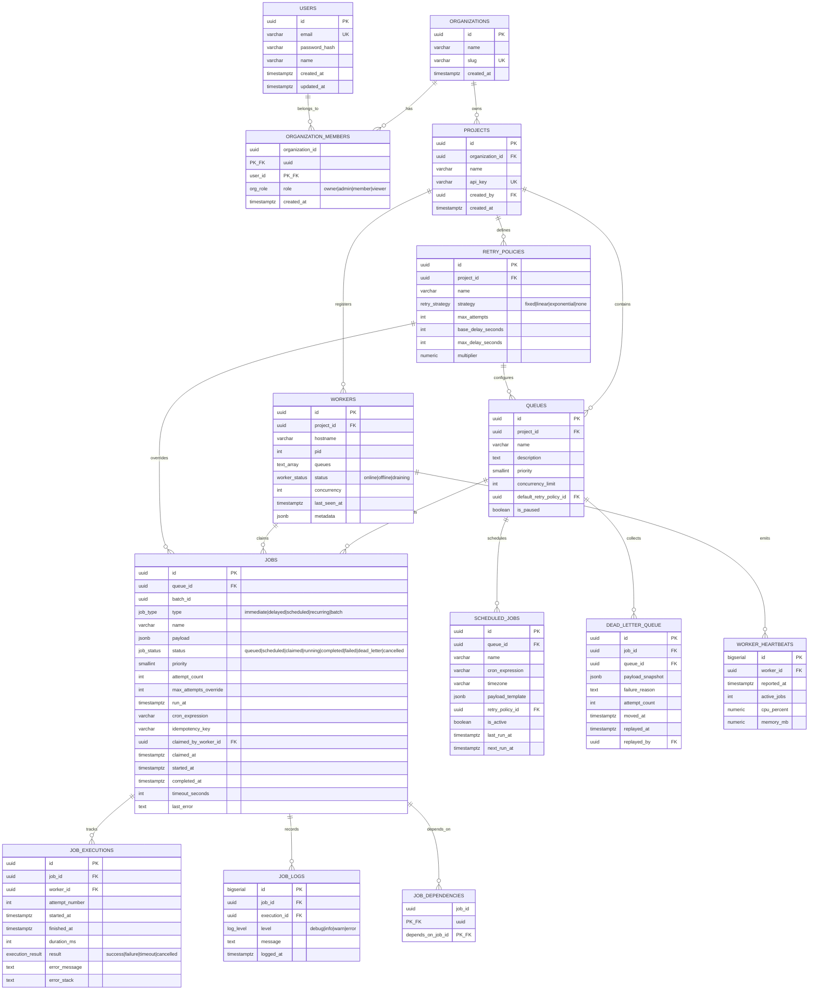

# Distributed Job Scheduler — Submission Report

**Name:** Harsh Jain
**Email:** harshjain@gmail.com

**Repository:** [github.com/kejal2005/distributed-job-scheduler](https://github.com/kejal2005/distributed-job-scheduler)
**Live Dashboard:** [distributed-job-scheduler-psi.vercel.app](https://distributed-job-scheduler-psi.vercel.app)
**Backend API:** `https://distributed-job-scheduler-x0zv.onrender.com`

---

## Table of Contents

1. [Executive Summary](#1-executive-summary)
2. [System Architecture](#2-system-architecture)
3. [Database Design](#3-database-design)
4. [Backend Engineering](#4-backend-engineering)
5. [Reliability & Concurrency](#5-reliability--concurrency)
6. [Frontend & UX](#6-frontend--ux)
7. [API Reference](#7-api-reference)
8. [Design Decisions & Trade-offs](#8-design-decisions--trade-offs)
9. [Testing Strategy](#9-testing-strategy)
10. [Deployment & Infrastructure](#10-deployment--infrastructure)
11. [Setup Instructions](#11-setup-instructions)
12. [Bonus Features Implemented](#12-bonus-features-implemented)

---

## 1. Executive Summary

This project is a production-grade distributed job scheduling platform that reliably processes asynchronous background jobs across multiple worker nodes. The system is modeled after real-world platforms like Sidekiq, BullMQ, and GitHub Actions — it provides multi-tenant project isolation, atomic job claiming with PostgreSQL row-level locks, configurable retry strategies with dead-letter support, cron-based recurring jobs, and a live operations dashboard powered by WebSockets.

The architecture is intentionally split into three independently deployable components:

- A **Control Plane** (REST API) that handles authentication, job ingestion, queue management, and worker coordination
- A **Worker Service** that polls the Control Plane, claims jobs atomically, and executes them concurrently
- A **Frontend Dashboard** that provides real-time observability into the entire system

All three are deployed to production and verified end-to-end from a mobile device over cellular data — no localhost dependency.

---

## 2. System Architecture

### High-Level Overview

```
┌─────────────────────────────────────────────────────────────────────┐
│                        FRONTEND (Vercel)                            │
│   Vanilla HTML/CSS/JS  •  Chart.js  •  WebSocket client             │
│   Views: Overview, Queues, Workers, Dead Letters, Recurring          │
└─────────────┬───────────────────────────────────┬───────────────────┘
              │ REST (HTTPS)                      │ WebSocket (WSS)
              ▼                                   ▼
┌─────────────────────────────────────────────────────────────────────┐
│                    CONTROL PLANE (Render)                            │
│                                                                     │
│  ┌──────────────┐  ┌──────────────┐  ┌───────────────────────────┐  │
│  │  Express API  │  │  WS Hub      │  │  Cron Scheduler           │  │
│  │  (REST)       │  │  (broadcast) │  │  (polls scheduled_jobs)   │  │
│  └──────┬───────┘  └──────────────┘  └───────────────────────────┘  │
│         │                                                           │
│  ┌──────┴────────────────────────────────────────────────────────┐  │
│  │  Middleware: JWT auth • API key auth • Zod validation         │  │
│  │  Rate limiter (600 req/min global) • Helmet security headers  │  │
│  └───────────────────────────────────────────────────────────────┘  │
└─────────────┬───────────────────────────────────────────────────────┘
              │ SQL (pg driver, connection pool max=20)
              ▼
┌─────────────────────────────────────────────────────────────────────┐
│                  POSTGRESQL 16 (Render)                              │
│  12 tables • 14 indexes • 3 auto-update triggers                    │
│  pgcrypto UUIDs • ENUMs for status/type/role                        │
│  FOR UPDATE SKIP LOCKED for atomic claiming                         │
└─────────────────────────────────────────────────────────────────────┘
              ▲
              │ REST (HTTPS) — workers are API clients, not DB clients
              │
┌─────────────┴───────────────────────────────────────────────────────┐
│                   WORKER SERVICE(S)                                  │
│  Standalone Node.js process  •  Polls /claim endpoint               │
│  Concurrent execution (configurable)  •  Heartbeats every 5s        │
│  Graceful shutdown on SIGTERM/SIGINT                                │
│  Can run N instances on different machines                          │
└─────────────────────────────────────────────────────────────────────┘
```

### Key Architectural Decisions

**Workers communicate via REST, not direct database access.** This is deliberate. Workers authenticate with a project-scoped API key and interact solely through the Control Plane's HTTP endpoints. This means workers can run on entirely separate networks or machines — they only need outbound HTTPS access to the API. It also means the database is never exposed publicly, and all authorization logic is enforced centrally.

**The WebSocket hub is a broadcast-only fan-out.** The API server emits structured JSON events (`job.created`, `job.completed`, `worker.registered`, etc.) on every state change. Connected dashboard clients receive these events and update their UI instantly. The hub does not receive commands from clients — it is strictly one-directional.

### Directory Structure

```
distributed-job-scheduler/
├── backend/
│   ├── migrations/
│   │   └── 001_init_schema.sql        # Full DDL: 12 tables, indexes, triggers
│   ├── src/
│   │   ├── server.js                  # HTTP + WebSocket bootstrap
│   │   ├── app.js                     # Express app factory (middleware, routes)
│   │   ├── config/
│   │   │   └── db.js                  # PG pool, query(), withTransaction()
│   │   ├── middleware/
│   │   │   ├── auth.js                # JWT + API key + RBAC middleware
│   │   │   └── errorHandler.js        # Centralized error handling
│   │   ├── repositories/
│   │   │   ├── jobRepository.js       # Atomic claim, retry/backoff logic
│   │   │   ├── queueRepository.js     # Queue CRUD + stats
│   │   │   └── authRepository.js      # User/org/project persistence
│   │   ├── routes/
│   │   │   ├── authRoutes.js          # Register, login, org/project CRUD
│   │   │   ├── queueRoutes.js         # Queue CRUD + claim + start/complete/fail
│   │   │   ├── jobRoutes.js           # Job CRUD + batch + cancel + replay
│   │   │   ├── workerRoutes.js        # Register, heartbeat, drain, offline
│   │   │   ├── dlqRoutes.js           # Dead letter queue listing
│   │   │   ├── scheduledJobRoutes.js  # Cron template CRUD
│   │   │   ├── retryPolicyRoutes.js   # Retry policy CRUD
│   │   │   └── dashboardRoutes.js     # Overview stats + queue health
│   │   ├── utils/
│   │   │   ├── wsHub.js               # WebSocket broadcast hub
│   │   │   ├── validation.js          # Zod schemas for all inputs
│   │   │   └── projectContext.js      # Project ID resolution helper
│   │   ├── workers/
│   │   │   └── worker.js              # Standalone worker process
│   │   └── scheduler/
│   │       └── cronScheduler.js       # Standalone cron scheduler process
│   ├── tests/
│   │   ├── auth.test.js               # 5 auth tests
│   │   ├── jobLifecycle.test.js       # 6 lifecycle tests (claim→complete, DLQ, cancel, pause, delay)
│   │   ├── concurrency.test.js        # 2 concurrency-correctness tests
│   │   └── helpers.js                 # Test fixtures + DB cleanup
│   └── package.json
├── frontend/
│   ├── index.html                     # Full SPA shell (auth, 5 dashboard views, modals)
│   ├── css/style.css                  # Custom design system (dark theme, glassmorphism)
│   └── js/
│       ├── api.js                     # HTTP client wrapper with auth header injection
│       └── app.js                     # All UI logic, routing, WebSocket, Chart.js
└── docs/
    ├── Architecture.md
    ├── Database_ERD.md
    ├── API_Documentation.md
    └── Design_Decisions.md
```

---

## 3. Database Design

### Entity-Relationship Diagram



### Tables Summary

| Table | Rows Expected | Purpose |
|:---|:---|:---|
| `organizations` | Low | Multi-tenant org containers |
| `users` | Low | Authenticated human operators |
| `organization_members` | Low | Many-to-many with RBAC roles |
| `projects` | Low | Logical grouping, each with a unique API key |
| `retry_policies` | Low | Reusable retry configurations |
| `queues` | Medium | Named job channels within a project |
| `jobs` | High | Central entity — the unit of work |
| `workers` | Low-Medium | Registered worker node metadata |
| `worker_heartbeats` | High (append-only) | Time-series health data for charts |
| `job_executions` | High | Per-attempt audit trail |
| `job_logs` | High | Structured log lines per execution |
| `scheduled_jobs` | Low | Cron templates for recurring work |
| `dead_letter_queue` | Low | Permanently failed job snapshots |
| `job_dependencies` | Low | DAG edges for workflow dependencies |

### Indexing Strategy

| Index | Type | Purpose |
|:---|:---|:---|
| `idx_jobs_claim_scan (queue_id, status, run_at) WHERE status IN (queued, scheduled)` | Partial composite | **Hot path.** This is the index the atomic claim query hits on every poll cycle. The partial filter eliminates completed/dead jobs from the scan entirely. |
| `idx_jobs_status` | B-Tree | Dashboard aggregate queries (count by status) |
| `idx_jobs_batch (batch_id) WHERE batch_id IS NOT NULL` | Partial | Batch job grouping lookups |
| `idx_jobs_cron (job_type, run_at) WHERE job_type = recurring` | Partial | Cron scheduler polling |
| `idx_jobs_created_at DESC` | B-Tree | Job listing pagination (newest first) |
| `idx_queues_project` | B-Tree | Project-scoped queue lookups |
| `idx_workers_project`, `idx_workers_status` | B-Tree | Worker listing and status filtering |
| `idx_heartbeats_worker_time (worker_id, reported_at DESC)` | Composite | Time-series heartbeat queries for dashboard charts |
| `idx_executions_job`, `idx_executions_worker` | B-Tree | Execution history lookups |
| `idx_job_logs_job (job_id, logged_at)` | Composite | Chronological log retrieval |
| `idx_scheduled_jobs_due (next_run_at) WHERE is_active = true` | Partial | Cron scheduler: find templates due to fire |
| `idx_dlq_queue`, `idx_dlq_unreplayed` | B-Tree / Partial | DLQ browsing and "needs attention" filter |

### Normalization & Cascading

The schema follows **3NF** with intentional denormalization in exactly one place: `jobs.attempt_count` mirrors what could be derived from `COUNT(*) FROM job_executions WHERE job_id = ?`. This trade-off avoids a join or subquery in the hot-path claim query, where every millisecond of lock time matters.

All foreign keys use deliberate cascade rules:
- `ON DELETE CASCADE` for ownership chains (org → project → queue → job)
- `ON DELETE SET NULL` for soft references (e.g., `jobs.claimed_by_worker_id` — if a worker row is deleted, existing jobs should not be destroyed, just un-assigned)

### PostgreSQL-Specific Features Used
- `pgcrypto` extension for `gen_random_uuid()` — cryptographically random UUIDs
- Custom `ENUM` types for `job_status`, `job_type`, `worker_status`, `org_role`, `retry_strategy`, `execution_result`, `log_level`
- `JSONB` columns for flexible payloads and worker metadata
- `TEXT[]` array type for worker queue assignments
- `FOR UPDATE SKIP LOCKED` for lock-free concurrent claiming
- `ON CONFLICT ... DO NOTHING` for idempotent job creation
- PL/pgSQL trigger function `touch_updated_at()` for automatic timestamp management

---

## 4. Backend Engineering

### Layered Architecture

The backend follows a clean three-layer separation:

1. **Routes** (`routes/*.js`) — HTTP request/response handling, input validation, response formatting
2. **Repositories** (`repositories/*.js`) — All SQL queries live here. Business logic like retry resolution and backoff computation happens at this layer.
3. **Config/Utils** — Database connection pooling (`config/db.js`), Zod schemas (`utils/validation.js`), WebSocket broadcast hub (`utils/wsHub.js`)

### Request Validation

Every mutating endpoint uses Zod schemas (defined in `validation.js`) applied as Express middleware. The validation middleware parses the request body, and if validation fails, returns a structured 400 response with field-level error details. Successfully validated data is attached as `req.validated`, keeping route handlers clean.

Schemas enforce:
- Email format validation for registration
- Minimum password length (8 characters)
- UUID format for all ID references
- Enum constraints for job types and retry strategies
- Positive integer constraints for concurrency limits and timeouts

### Error Handling

A centralized error handler catches all exceptions and returns consistent JSON error responses:
- `ApiError` class for known business errors (404, 409, 422)
- `asyncHandler` wrapper for async route handlers to catch unhandled promise rejections
- Stack traces are suppressed in production

### Security

- **Password hashing:** bcryptjs with default salt rounds
- **JWT tokens:** 7-day expiry, `sub` claim contains user ID
- **API key authentication:** Workers authenticate with project-scoped keys via `X-API-Key` header
- **Helmet:** Sets security headers (X-Frame-Options, X-Content-Type-Options, HSTS, etc.)
- **Rate limiting:** Global rate limiter at 600 requests per minute per IP (via express-rate-limit)
- **CORS:** Enabled globally to allow cross-origin requests from the Vercel-hosted frontend

---

## 5. Reliability & Concurrency

### The Atomic Claim Query

This is the core of the system's reliability guarantee. The claim query in `jobRepository.claimJobs()` works as follows:

```sql
-- Step 1: Lock the queue row exclusively (prevents concurrent limit checks from racing)
SELECT * FROM queues WHERE id = $1 FOR UPDATE

-- Step 2: Count currently in-flight jobs to enforce concurrency_limit
SELECT count(*)::int FROM jobs WHERE queue_id = $1 AND status IN ('claimed','running')

-- Step 3: Claim eligible jobs atomically
SELECT j.id FROM jobs j
WHERE j.queue_id = $1
  AND j.status IN ('queued', 'scheduled')
  AND j.run_at <= now()
  AND NOT EXISTS (
    SELECT 1 FROM job_dependencies d
    JOIN jobs dep ON dep.id = d.depends_on_job_id
    WHERE d.job_id = j.id AND dep.status <> 'completed'
  )
ORDER BY j.priority DESC, j.run_at ASC, j.created_at ASC
LIMIT $2
FOR UPDATE SKIP LOCKED
```

**Why this works:**
- `FOR UPDATE SKIP LOCKED` means if Worker A is in the middle of claiming a row, Worker B skips that row entirely — no blocking, no waiting, no deadlocks, and absolutely no double-claiming.
- The queue-level `FOR UPDATE` lock (without SKIP LOCKED) serializes the concurrency_limit check per queue. Without this, two workers could both read "2 of 5 slots used" and each proceed, together exceeding the limit. This lock is held for only a few milliseconds.
- Dependency resolution happens inline via the `NOT EXISTS` subquery — a job with unfinished dependencies is simply invisible to the claim scan.

### Retry & Backoff

When a job fails, `markFailedAndResolve()` evaluates the job's retry policy:

1. If `attempt_count >= max_attempts` → move to Dead Letter Queue (insert snapshot into `dead_letter_queue`, set status to `dead_letter`)
2. Otherwise → compute backoff delay, set `run_at = now() + delay`, reset status to `queued`

Backoff computation supports three strategies:
- **Fixed:** `delay = base_delay_seconds` (constant)
- **Linear:** `delay = base_delay_seconds × attempt_count`
- **Exponential:** `delay = base_delay_seconds × multiplier^(attempt_count - 1)`

All strategies are capped at `max_delay_seconds` to prevent unbounded delays.

### Worker Lifecycle

1. **Registration:** Worker calls `POST /workers/register` with hostname, PID, queue list, concurrency
2. **Polling:** Worker calls `POST /queues/:id/claim` every 1 second (configurable)
3. **Execution:** For each claimed job: call `/start`, execute handler, then call `/complete` or `/fail`
4. **Heartbeat:** Every 5 seconds, worker sends `POST /workers/:id/heartbeat` with active job count
5. **Graceful shutdown:** On SIGTERM/SIGINT, worker stops polling, waits for in-flight jobs (up to 15s timeout), marks itself offline, exits

### Idempotent Job Creation

The `jobs` table has a unique constraint on `(queue_id, idempotency_key)`. The INSERT query uses `ON CONFLICT DO NOTHING`. If a caller submits the same idempotency key twice on the same queue, the second call returns a 409 with no side effects. This prevents duplicate job creation in retry-prone environments.

---

## 6. Frontend & UX

### Design System

The dashboard uses a custom dark-theme design system built with vanilla CSS (no frameworks). Key design choices:
- **Typography:** IBM Plex Mono for code/data, Inter for UI text (loaded from Google Fonts)
- **Color palette:** Dark background (#0a0e17), cyan accents for active states, red for errors/dead letters, green for success
- **Glassmorphism:** Auth card and stat cards use `backdrop-filter: blur` with semi-transparent backgrounds
- **Responsive:** CSS Grid layout adapts to screen sizes

### Dashboard Views

| View | Description |
|:---|:---|
| **Overview** | Stat cards (Pending, Running, Completed, Dead-lettered, Online Workers), 24h throughput chart (Chart.js), live job stream (WebSocket-fed), queue health table |
| **Queues** | List all queues with create/pause/resume controls. Click a queue to see its jobs with status filtering. Create new jobs with payload editor. |
| **Workers** | Table of registered workers showing hostname, status, assigned queues, concurrency, active jobs, last seen timestamp |
| **Dead Letters** | Failed jobs that exhausted retries. Shows failure reason, attempt count, and a "Replay" button to requeue |
| **Recurring** | Cron template management. Create schedules with cron expressions. Shows next run time and active/inactive toggle. |

### Real-time Updates

The frontend establishes a WebSocket connection to `wss://<backend>/ws`. The connection indicator in the sidebar shows:
- 🟢 `live` — connected and receiving events
- 🟡 `connecting…` — initial connection or reconnecting
- 🔴 `offline` — connection lost

Events flow through to update stat cards, the live job stream, and trigger toast notifications — all without page refreshes or polling.

---

## 7. API Reference

### Authentication

| Method | Endpoint | Auth | Description |
|:---|:---|:---|:---|
| POST | `/api/auth/register` | None | Create a new user account. Returns JWT + user object. |
| POST | `/api/auth/login` | None | Authenticate with email/password. Returns JWT. |
| GET | `/api/auth/me` | JWT | Get current user profile. |
| POST | `/api/auth/organizations` | JWT | Create a new organization. |
| POST | `/api/auth/projects` | JWT | Create a new project (generates API key). |
| GET | `/api/auth/projects` | JWT | List all projects for the current user. |

### Queue Management

| Method | Endpoint | Auth | Description |
|:---|:---|:---|:---|
| GET | `/api/projects/:pid/queues` | API Key | List all queues in a project. |
| POST | `/api/projects/:pid/queues` | API Key | Create a new queue. |
| GET | `/api/projects/:pid/queues/:qid` | API Key | Get queue details. |
| PATCH | `/api/projects/:pid/queues/:qid` | API Key | Update queue settings. |
| POST | `/api/projects/:pid/queues/:qid/pause` | API Key | Pause a queue (stops claiming). |
| POST | `/api/projects/:pid/queues/:qid/resume` | API Key | Resume a paused queue. |
| GET | `/api/projects/:pid/queues/:qid/stats` | API Key | Get queue statistics. |

### Job Management

| Method | Endpoint | Auth | Description |
|:---|:---|:---|:---|
| GET | `/api/projects/:pid/queues/:qid/jobs` | API Key | List jobs. Supports `?status=` filter and `?limit=&offset=` pagination. |
| POST | `/api/projects/:pid/queues/:qid/jobs` | API Key | Create a job (immediate, delayed, scheduled, or recurring). |
| POST | `/api/projects/:pid/queues/:qid/jobs/batch` | API Key | Create up to 1000 jobs atomically with a shared `batch_id`. |
| GET | `/api/projects/:pid/queues/:qid/jobs/:jid` | API Key | Get job details. |
| POST | `/api/projects/:pid/queues/:qid/jobs/:jid/cancel` | API Key | Cancel a queued/scheduled job. |
| POST | `/api/projects/:pid/queues/:qid/jobs/:jid/replay` | API Key | Requeue a dead-lettered job (resets attempt count). |
| GET | `/api/projects/:pid/queues/:qid/jobs/:jid/executions` | API Key | Get execution history for a job. |
| GET | `/api/projects/:pid/queues/:qid/jobs/:jid/logs` | API Key | Get structured logs for a job. |

### Worker Coordination

| Method | Endpoint | Auth | Description |
|:---|:---|:---|:---|
| GET | `/api/projects/:pid/workers` | API Key | List all workers (with active job counts). |
| POST | `/api/projects/:pid/workers/register` | API Key | Register a new worker node. |
| POST | `/api/projects/:pid/workers/:wid/heartbeat` | API Key | Update worker liveness + record heartbeat. |
| POST | `/api/projects/:pid/workers/:wid/drain` | API Key | Signal worker is draining (no new claims). |
| POST | `/api/projects/:pid/workers/:wid/offline` | API Key | Mark worker as offline. |
| POST | `/api/projects/:pid/queues/:qid/claim` | API Key | **Atomic claim.** Request up to N jobs from a queue. |
| POST | `/api/projects/:pid/queues/:qid/jobs/:jid/start` | API Key | Transition job from claimed → running. Creates execution record. |
| POST | `/api/projects/:pid/queues/:qid/jobs/:jid/complete` | API Key | Mark job as completed. Updates execution with duration. |
| POST | `/api/projects/:pid/queues/:qid/jobs/:jid/fail` | API Key | Report job failure. Triggers retry or DLQ logic. |

### Other

| Method | Endpoint | Auth | Description |
|:---|:---|:---|:---|
| GET | `/api/projects/:pid/retry-policies` | API Key | List retry policies. |
| POST | `/api/projects/:pid/retry-policies` | API Key | Create a retry policy. |
| GET | `/api/projects/:pid/queues/:qid/scheduled-jobs` | API Key | List cron schedule templates. |
| POST | `/api/projects/:pid/queues/:qid/scheduled-jobs` | API Key | Create a cron schedule. |
| GET | `/api/projects/:pid/dead-letter-queue` | API Key | List dead-lettered jobs. |
| GET | `/api/projects/:pid/dashboard/overview` | API Key | Aggregate stats (status counts, worker count, 24h throughput). |
| GET | `/api/projects/:pid/dashboard/health` | API Key | Per-queue health (pending, running, dead, avg duration). |
| GET | `/health` | None | Liveness check. |
| WS | `/ws` | None | WebSocket endpoint for real-time event streaming. |

---

## 8. Design Decisions & Trade-offs

### Why PostgreSQL as the queue engine (not Redis or RabbitMQ)

I chose to use PostgreSQL's `SELECT ... FOR UPDATE SKIP LOCKED` as the queue mechanism rather than introducing a separate message broker.

**Advantages:**
- Single data store for metadata and the queue. No need to synchronize state between two systems.
- Full ACID compliance — job state transitions happen inside transactions, so a crashed worker mid-claim cannot corrupt state.
- The `SKIP LOCKED` advisory mechanism gives lock-free concurrency: workers never block each other, and the database handles contention at the row level.
- Simpler deployment — one fewer service to provision, monitor, and pay for.

**Disadvantages:**
- Lower raw throughput than an in-memory broker like Redis. Postgres handles thousands of claims per second; Redis handles hundreds of thousands. For this use case, Postgres is more than sufficient.
- Index bloat under sustained high load (frequent UPDATEs on the `jobs` table). In production, this would require aggressive autovacuum tuning.

**When I'd reach for Redis:** If the system needed sub-millisecond latency, 100K+ jobs/second, or pub/sub fan-out to thousands of workers. At that scale, I'd front Postgres with a Redis queue for hot-path operations and use Postgres as the durable source of truth.

### Why decoupled workers (not in-process execution)

Workers run as completely separate Node.js processes that communicate with the Control Plane exclusively via HTTP.

**Advantages:**
- True horizontal scaling. Spin up 50 workers on 50 machines if you need to.
- Fault isolation. A worker crash does not affect the API or other workers. The job simply times out and gets retried.
- Security in multi-tenant scenarios. Each worker authenticates with a project-specific API key. A rogue worker from Tenant A cannot access Tenant B's jobs.

**Disadvantages:**
- Added network latency (HTTP round-trip for every claim, start, complete, fail).
- Operational overhead for users who just want simple background jobs. They need to run a separate process.

**Why this is the right trade-off for this project:** The assignment is called "Distributed Job Scheduler." The word "distributed" implies that job execution should be decoupled from job coordination. Embedding execution in the API server would be a monolith, not a distributed system.

### Why WebSockets (not polling)

The dashboard receives real-time updates via a persistent WebSocket connection rather than polling the REST API.

**Advantages:**
- Instant updates. When a job completes, the dashboard stat card updates in milliseconds, not after a 5-second polling interval.
- Lower database load. One broadcast to N clients is cheaper than N clients each hitting a stats endpoint every few seconds.

**Disadvantages:**
- Stateful connections. If the API is scaled horizontally behind a load balancer, WebSocket connections become sticky. A Redis pub/sub backplane would be needed to broadcast across instances.
- WebSocket connections can be flaky on mobile networks. The client implements reconnection logic to handle drops.

### Why vanilla HTML/CSS/JS (not React/Vue)

The frontend is a static single-page application with no build step, no bundler, no framework.

**Rationale:** The dashboard is a read-heavy monitoring tool, not a complex interactive application. It has five views with tables, charts, and modals. A framework would add hundreds of kilobytes of JavaScript, a build pipeline, and configuration complexity — none of which would meaningfully improve the user experience for this use case. The entire frontend is two JS files (api.js and app.js) that can be served from any static file host.

---

## 9. Testing Strategy

### Test Suite

The project includes **13 automated tests** across three test files, built with Jest and Supertest:

**`auth.test.js`** (5 tests)
- Registers a new user and returns a JWT
- Rejects duplicate email registration (409)
- Rejects weak passwords at the validation layer (400)
- Logs in with correct credentials; rejects wrong password (401)
- Rejects unauthenticated requests to protected routes (401)

**`jobLifecycle.test.js`** (6 tests)
- Creates a job in `queued` state
- Idempotency key prevents duplicate job creation on the same queue (409)
- Full happy path: claim → start → complete (with execution record verification)
- Job that exceeds max_attempts moves to the dead letter queue (with backoff wait)
- Cancelling a queued job prevents it from being claimed
- A paused queue yields no claimable jobs
- Delayed jobs are not claimable until `run_at` has passed

**`concurrency.test.js`** (2 tests)
- **N concurrent workers claiming from a queue of M jobs never double-claim, and every job is claimed exactly once.** This test creates 20 jobs, registers 10 workers, fires all 10 claim requests concurrently with `Promise.all`, and verifies: (a) no job ID appears twice in the results, (b) all claimed IDs belong to the original set, (c) total claimed does not exceed total available.
- **Claim respects the queue `concurrency_limit` even under concurrent requests.** Sets limit to 5, creates 20 jobs, 10 workers claim concurrently, verifies total claimed ≤ 5.

### Running Tests
```bash
cd backend
createdb job_scheduler_test
psql -d job_scheduler_test -f migrations/001_init_schema.sql
npm test
```

---

## 10. Deployment & Infrastructure

| Component | Host | Tier | URL |
|:---|:---|:---|:---|
| Frontend | Vercel | Free | `distributed-job-scheduler-psi.vercel.app` |
| Backend API + Worker | Render (Web Service) | Free | `distributed-job-scheduler-x0zv.onrender.com` |
| PostgreSQL 16 | Render (Managed Postgres) | Free | Internal connection only |

### How the worker runs in production

Render's free tier only supports Web Services (not Background Workers). To run both the API and the worker in a single free container while maintaining architectural decoupling, the Render Start Command is set to:

```bash
npm run worker & npm start
```

This launches the worker as a background process and the API in the foreground. The worker communicates with the API via `localhost` HTTP (since they share the container), but the code is identical to what would run on a separate machine — the worker uses the same REST endpoints and API key authentication. If the project scaled beyond the free tier, the worker would simply be deployed as a separate Render Background Worker service with zero code changes.

The worker includes a startup retry mechanism (15 attempts, 2-second intervals) to handle the race condition where the worker process starts before the Express server is ready to accept connections.

### End-to-end verification

The deployment was verified end-to-end by accessing the live Vercel URL from a smartphone over cellular data (completely disconnected from the development machine). Registration, login, job creation, and job completion by the cloud-hosted worker all succeeded — confirming that no component depends on localhost or the developer's local environment.

---

## 11. Setup Instructions

### Prerequisites
- Node.js 18+
- PostgreSQL 14+

### Local Development

```bash
# 1. Clone the repository
git clone https://github.com/kejal2005/distributed-job-scheduler.git
cd distributed-job-scheduler

# 2. Create the database and run migrations
createdb job_scheduler
psql -d job_scheduler -f backend/migrations/001_init_schema.sql

# 3. Start the API server
cd backend
npm install
cp .env.example .env   # adjust PGHOST, PGUSER, PGPASSWORD, PGDATABASE if needed
npm start               # API runs on http://localhost:4000

# 4. Start one or more workers (in separate terminals)
cd backend
PROJECT_ID=<id> PROJECT_API_KEY=<key> WORKER_QUEUES=emails,reports npm run worker

# 5. Start the cron scheduler (one instance)
cd backend
npm run scheduler

# 6. Open the dashboard
cd frontend
python3 -m http.server 5173   # or any static file server
# Open http://localhost:5173
# Register → Create a project → Copy the API key into the worker env vars
```

---

## 12. Bonus Features Implemented

| Bonus Feature | Status | Implementation Details |
|:---|:---|:---|
| **Workflow dependencies** | ✅ | `job_dependencies` table stores DAG edges. The claim query's `NOT EXISTS` subquery checks all dependencies are `completed` before a job becomes eligible. |
| **Rate limiting** | ✅ | Global rate limiter (600 req/min) via `express-rate-limit`. Helmet security headers. |
| **Distributed locking** | ✅ | `FOR UPDATE SKIP LOCKED` for job claiming. Queue-level `FOR UPDATE` lock for concurrency_limit enforcement. |
| **Event-driven execution** | ✅ | WebSocket hub broadcasts structured JSON events on every state change. |
| **WebSocket live updates** | ✅ | Dashboard receives instant updates via persistent WebSocket connection. Live job stream, auto-updating stat cards. |
| **Role-based access control** | ✅ | `org_role` ENUM (`owner`, `admin`, `member`, `viewer`). `organization_members` many-to-many table. `requireRole()` middleware. |
| **Batch job creation** | ✅ | `POST /jobs/batch` creates up to 1000 jobs with a shared `batch_id` for grouped tracking. |
| **Idempotent job submission** | ✅ | Unique constraint on `(queue_id, idempotency_key)` with `ON CONFLICT DO NOTHING`. |
| **Configurable retry strategies** | ✅ | Fixed, linear, and exponential backoff with per-policy `base_delay`, `max_delay`, and `multiplier`. |
| **Queue pause/resume** | ✅ | `is_paused` flag checked atomically inside the claim transaction. |
| **Graceful worker shutdown** | ✅ | SIGTERM/SIGINT handlers drain in-flight jobs, mark worker offline, then exit. |
